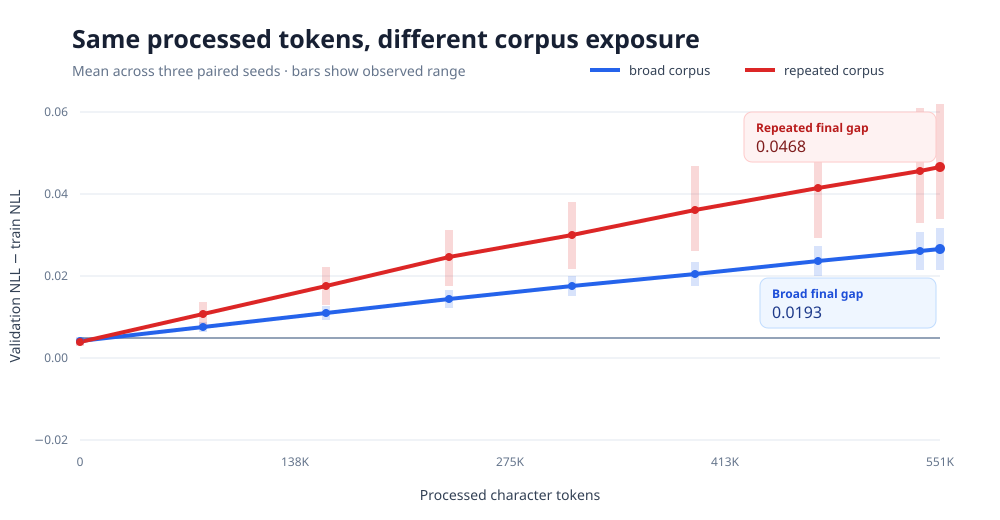

# ScaleLab-RS

[](https://github.com/kraftaa/ScaleLab-RS/actions/workflows/ci.yml)

**Reproducible scaling experiments for tiny Transformers in Rust.**

Two identical 27,520-parameter Transformers processed the same 550,656-token
budget. One repeatedly replayed 25,184 characters; the other trained from a
719,847-character corpus. Across three paired seeds, the repeated-data model
fit its training data slightly better but generalized worse.



| Condition | Processed tokens | Effective epochs | Validation NLL | Generalization gap |
|---|---:|---:|---:|---:|
| Broad corpus | 550,656 | 0.76 | **3.1952** | **0.0193** |
| Repeated corpus | 550,656 | 21.87 | 3.2165 | 0.0468 |

> **550K processed tokens do not mean 550K new information.**

Read the [complete result and limitations](docs/RESULTS.md), then reproduce it
from the checked-in manifest rather than trusting the graph.

An educational GPT-style language model written in Rust with
[Candle](https://github.com/huggingface/candle). The goal is to make every
important operation visible while letting Candle handle tensors, automatic
differentiation, and optimized numerical kernels.

This is an experiment harness, not merely a model implementation. Its MVP asks
why equal tokens-per-parameter does not necessarily imply equal corpus
exposure: one model can repeatedly reuse a short corpus while another draws the
same number of processed tokens from a broader collection.

For controlled experiments, ScaleLab deterministically initializes parameters
from the configured seed and parameter name, saves one initial SafeTensor per
seed, and loads it into every paired run. This works around Candle's currently
unseeded default CPU initializer and makes fresh clones reproducible.

## What you can learn from it

Follow the data through these five transformations:

1. Text becomes integer token IDs in `src/data.rs`.
2. Token and position IDs become vectors in `Gpt::forward`.
3. Each attention head creates query, key, and value tensors in
   `CausalSelfAttention::forward`.
4. A triangular mask prevents information from travelling backward from future
   tokens.
5. Cross-entropy compares every predicted next-token distribution with the
   actual next token.

The model uses pre-normalization Transformer blocks:

```text
x ── LayerNorm ── causal self-attention ── + ── LayerNorm ── MLP ── +
│                                           ↑                 │       ↑
└───────────────────────────────────────────┘                 └───────┘
```

## Run it

Install a current stable Rust toolchain, then check the complete fixture
experiment:

```sh
cargo run -- check experiments/smoke-mvp.toml
```

The check instantiates the model, counts its parameters, tokenizes every corpus,
calculates processed-token targets and effective epochs, and verifies the
experiment controls before training starts.

Run the fixture experiment and produce its report:

```sh
cargo run --release -- experiment experiments/smoke-mvp.toml
cargo run -- report runs/smoke-mvp-seeded
```

Open `runs/smoke-mvp-seeded/report/index.html` to see the three-seed aggregate,
paired-run comparison, and detailed NLL curves. The publishable artifact is
`headline-comparison.svg`: it shows only runs with the same maximum
processed-token budget, with observed seed ranges. The fixture is deliberately
tiny and validates the workflow; it is not evidence about scaling behavior.

Run the substantive three-seed experiment from public-domain books:

```sh
./scripts/prepare-mvp-data.sh
cargo run -- check experiments/mvp.toml
cargo run --release -- experiment experiments/mvp.toml
cargo run --release -- report runs/mvp
```

The data script downloads the source texts, strips their Project Gutenberg
wrappers, normalizes them, and records source and output SHA-256 hashes. The
completed experiment and its limitations are summarized in
[`docs/RESULTS.md`](docs/RESULTS.md).

## Single-run learning mode

The original learning commands remain available. Validate a single-run file:

```sh
cargo run -- check-run configs/tiny-shakespeare.toml
```

Place a corpus at `data/tiny-shakespeare.txt`, then train:

```sh
cargo run --release -- train configs/tiny-shakespeare.toml
```

Load the saved run and generate text with deterministic greedy decoding:

```sh
cargo run --release -- sample runs/tiny-shakespeare "ROMEO:" --tokens 200
```

The run writes:

```text
runs/tiny-shakespeare/
├── config.resolved.toml
├── metrics.jsonl
├── model.safetensors
└── tokenizer.json
```

Loss is reported as negative log-likelihood in **nats per token**. Perplexity is
`exp(nll)`. Do not directly compare token-level losses from different
tokenizers; token boundaries change the unit being averaged.

## Recommended learning sequence

1. Run the unit tests and read each test before its implementation.
2. Run `configs/smoke.toml` on a repeated paragraph and confirm that loss falls.
3. Intentionally train on one batch until it is memorized.
4. Train on Tiny Shakespeare and observe the train/validation gap.
5. Change only one variable at a time: data amount, layer count, width, context,
   or tokenizer.
6. Add BPE through the Rust `tokenizers` crate after the character model is
   completely understandable.

## Deliberate omissions in the first version

- Character tokenization keeps the text-to-ID mapping obvious.
- CPU-only execution keeps backend setup out of the first lesson.
- No dropout, label smoothing, scheduler, mixed precision, or fused attention.
- Input and output embeddings are not tied yet, so their roles remain visible.

These are staged extensions, not missing fundamentals. First establish a
correct baseline; then measure every additional mechanism against it.

For a shape-by-shape explanation of the complete forward pass, read
[`docs/ARCHITECTURE.md`](docs/ARCHITECTURE.md).

The controlled experiment design and artifact contract are documented in
[`docs/MVP.md`](docs/MVP.md).
